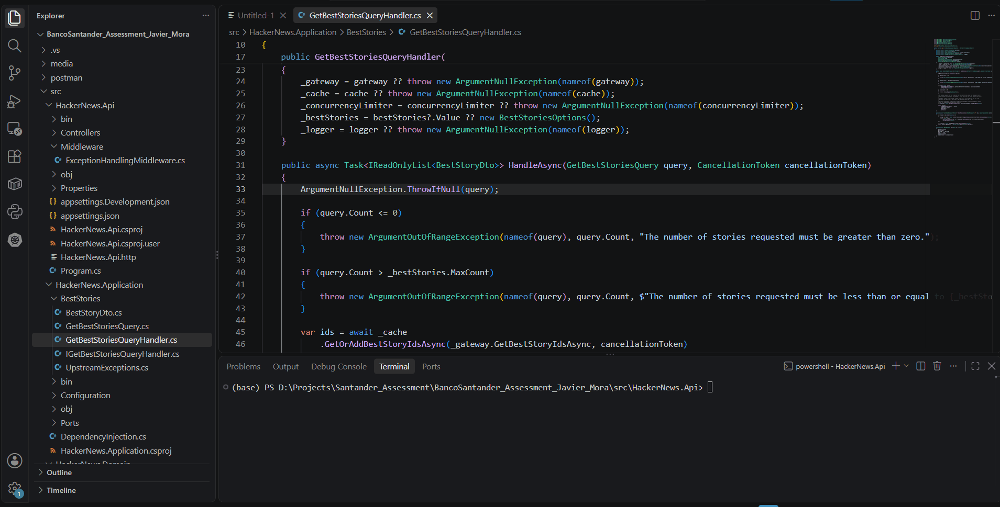

# API de Mejores Historias de Hacker News

API REST construida con ASP.NET Core (.NET 10) que devuelve las mejores `n`
historias de Hacker News, ordenadas por `score` de forma descendente, protegiendo la
API de Hacker News frente a sobrecarga mediante caché y concurrencia acotada.

---

## Descripción general

La API:

- obtiene los ids de las mejores historias desde Hacker News (`/v0/beststories.json`),
- recupera el detalle de cada historia (`/v0/item/{id}.json`),
- ordena los resultados por `score` de forma descendente,
- devuelve las `n` primeras,
- protege el servicio externo mediante caché en memoria y concurrencia acotada.

---

## Demo




## Requisitos

- [.NET SDK 10.0](https://dotnet.microsoft.com/download) (desarrollado con 10.0.401)
- Acceso a Internet en tiempo de ejecución (para alcanzar la API pública de Hacker News)

No se requiere base de datos, broker de mensajería ni infraestructura externa.

---

## Arquitectura

La solución utiliza una **Arquitectura Hexagonal ligera (Puertos y Adaptadores)** con
**DDD pragmático** y **CQRS ligero**. Las reglas de dependencia las impone el
compilador mediante proyectos separados, y no solo por convención.

### Motivación de las decisiones

- **CQRS ligero**: el servicio es de solo lectura, por lo que solo se modela el lado
  *Query* (`GetBestStoriesQuery` + `GetBestStoriesQueryHandler`). No se introduce un
  lado *Command* artificial.
- **Sin MediatR**: basta con un handler simple registrado por DI. MediatR añadiría un
  pipeline/bus sin beneficio real en este caso.
- **Sin patrón Repository**: no hay persistencia. Modelar una integración HTTP como un
  repositorio sería engañoso. En su lugar, un **puerto** `IHackerNewsGateway` expresa
  la intención.
- **DDD pragmático**: `Story` es un modelo interno simple. No se introducen agregados,
  objetos de valor, eventos de dominio ni servicios de dominio porque no hay
  invariantes que proteger.

### Estructura del proyecto

```
src/
  HackerNews.Domain/          # Modelo de dominio puro (sin dependencias de framework)
	Stories/Story.cs
  HackerNews.Application/      # Casos de uso (query CQRS), puertos, opciones
	BestStories/
	  GetBestStoriesQuery.cs
	  GetBestStoriesQueryHandler.cs
	  IGetBestStoriesQueryHandler.cs
	  BestStoryDto.cs
	  UpstreamExceptions.cs
	Ports/
	  IHackerNewsGateway.cs
	  IStoryCache.cs
	  IUpstreamConcurrencyLimiter.cs
	Configuration/Options.cs
	DependencyInjection.cs
  HackerNews.Infrastructure/   # Adaptadores: cliente HTTP, caché, limitador
	HackerNews/
	  HackerNewsClient.cs
	  HackerNewsItemResponse.cs
	Caching/MemoryStoryCache.cs
	Concurrency/SemaphoreUpstreamConcurrencyLimiter.cs
	DependencyInjection.cs
  HackerNews.Api/              # Capa API fina: controlador, middleware, DI
	Controllers/BestStoriesController.cs
	Middleware/ExceptionHandlingMiddleware.cs
	Program.cs

tests/
  HackerNews.Application.Tests/     # Handler de query: validación, orden, top-up, cancelación
  HackerNews.Infrastructure.Tests/  # Mapeo del cliente HTTP, tiempo Unix, nulos, caché, stampede
  HackerNews.Api.Tests/             # Contrato HTTP: 200/400/502/504 vía WebApplicationFactory

postman/
  HackerNews.Api.postman_collection.json
```

### Dirección de dependencias

```
Api ──────────────► Application ──────► Domain
  │                     ▲   ▲
  └──► Infrastructure ──┘   │
			  └─────────────┘

Domain no depende de nada.
Application depende únicamente de Domain.
Infrastructure implementa los puertos de Application y depende de Application + Domain.
Api compone todo el conjunto.
```

### Flujo de una petición

```
					Swagger UI (/swagger)
							│
Postman / Cliente ──► API ASP.NET Core (BestStoriesController)
							│
					GetBestStoriesQuery
							│
				 GetBestStoriesQueryHandler
					 /                \
					▼                  ▼
		   IHackerNewsGateway     IStoryCache
					▲                  ▲
					│                  │
			HackerNewsClient     MemoryStoryCache
			  (HttpClient tipado) (IMemoryCache)
					│
					▼
			 API de Hacker News
```

Pasos para `GET /api/best-stories?n=10`:

1. Validar `n` (`1..MaxCount`).
2. Obtener los ids de las mejores historias (de caché o del servicio externo).
3. Recuperar el detalle de **todos** los ids candidatos con concurrencia acotada, reutilizando la caché por ítem.
4. Descartar los ítems nulos/fallidos.
5. Ordenar por `score` de forma descendente.
6. Tomar `n` y mapear al DTO público.
7. Devolver JSON.

### Cómo se determinan las "n mejores" historias

`/beststories.json` devuelve los ids de las historias que Hacker News considera relevantes, pero
esa lista **no** representa una clasificación estricta por `score` (combina puntuación, antigüedad
y otros factores). Sin embargo, el ejercicio requiere devolver las `n` historias con mayor
`score`. Por este motivo, **no** se confía en el orden de los ids: se recuperan los detalles de
**todos** los candidatos y, posteriormente, se aplica:

```csharp
OrderByDescending(story => story.Score).Take(n))
```

Ejemplo sencillo. Supongamos que Hacker News devuelve los siguientes ids candidatos:

```
A -> score 300
B -> score 250
C -> score 200
D -> score 900
E -> score 800
```

For `n = 3`, fetching only A, B and C would incorrectly return:

```
300, 250, 200
```

The correct result by score is:

```
900, 800, 300
```

**Trade-off.** With a cold cache, the first request may need to fetch many items
(up to 500) instead of just `n`. This prioritises functional correctness. The cost is
kept under control through **global bounded concurrency**
(`HackerNews:MaxConcurrency`), **item-level caching** and **cache stampede protection**,
so subsequent requests are served almost entirely from cache. In a large-scale
production system, additional options such as background refresh, a distributed cache or
periodic preloading could be considered, but they are not required for this exercise.

---

## Ejecución de la aplicación

```sh
dotnet restore
dotnet build
dotnet run --project src/HackerNews.Api --launch-profile https
```

En Visual Studio, selecciona el perfil **https** (el predeterminado) y pulsa F5 / Ejecutar.
El navegador se abre automáticamente en la Swagger UI.

URLs de desarrollo (ver `src/HackerNews.Api/Properties/launchSettings.json`):

- **HTTPS (principal): `https://localhost:7037`**
- HTTP: `http://localhost:5100` — redirigido automáticamente a HTTPS (`307`) por `UseHttpsRedirection()`.

> **Certificado de desarrollo HTTPS**: si el navegador (o la Swagger UI) informa de un
> certificado no confiable, confía una vez en el certificado de desarrollo de ASP.NET Core:
>
> ```sh
> dotnet dev-certs https --trust
> ```
>
> Ejecuta y prueba siempre a través de la URL HTTPS para que las llamadas "Try it out"
> de Swagger no queden bloqueadas por la redirección HTTP→HTTPS.

### Endpoint

```
GET /api/best-stories?n=10
```

Ejemplo con curl:

```sh
curl "https://localhost:7037/api/best-stories?n=10"
```

### Ejemplo de respuesta

```json
[
  {
	"title": "A Ublock Origin update was rejected from the Chrome Web Store",
	"uri": "https://github.com/uBlockOrigin/uBlock-issues/issues/745",
	"postedBy": "ismailidmondez",
	"time": "2019-10-12T13:43:01+00:00",
	"score": 1716,
	"commentCount": 572
  }
]
```

---

## Swagger / OpenAPI

La Swagger UI la sirve **Swashbuckle** y está disponible (en desarrollo) en:

```
https://localhost:7037/swagger
```

El documento OpenAPI en crudo está disponible en:

```
https://localhost:7037/swagger/v1/swagger.json
```

Ambos son también accesibles mediante rutas relativas (`/swagger`, `/swagger/v1/swagger.json`).
Usa la URL HTTPS para que las peticiones "Try it out" de Swagger no queden bloqueadas
por la redirección HTTP→HTTPS.

> Nota: el soporte integrado de .NET 10 `AddOpenApi()`/`MapOpenApi()` solo sirve el
> documento JSON de OpenAPI (sin interfaz interactiva). Aquí se usa Swashbuckle para
> proporcionar una interfaz interactiva y poder explorar y probar la API directamente
> desde el navegador.

---

## Postman

Se incluye una colección en `postman/HackerNews.Api.postman_collection.json`.

1. Impórtala en Postman.
2. Establece la variable de colección `baseUrl` (p. ej. `https://localhost:7037`, o
   `http://localhost:5100`, que redirige a HTTPS).
3. Ejecuta las peticiones: `n=1`, `n=10`, `n=20`, `n=0`, `n=-1`, `n=101`.

Repite una petición válida (p. ej. `n=20`) varias veces para observar el efecto de la
caché (las llamadas posteriores no acceden al servicio externo mientras la caché está
caliente).

---

## Pruebas

```sh
dotnet test
```

Las pruebas nunca acceden a la red. Utilizan fakes simples y un `HttpMessageHandler`
de prueba. No se usa Moq.

- **HackerNews.Application.Tests** – comportamiento del handler de query: `n<=0` y
  `n>max` rechazados, se devuelven exactamente `n`, orden por score (incluido el top-n
  **global** cuando los scores más altos no están al principio del listado), mapeo, los
  ítems nulos/fallidos se descartan, y propagación de cancelación.
- **HackerNews.Infrastructure.Tests** – mapeo de `HackerNewsClient`, conversión de
  marca de tiempo Unix, gestión de `url`/`descendants` nulos, mapeo de errores del
  servicio externo, y caché de `MemoryStoryCache` más deduplicación concurrente (cache
  stampede).
- **HackerNews.Api.Tests** – contrato HTTP vía `WebApplicationFactory`: 200 con
  resultados ordenados y nombres de propiedad correctos, 400 para `n` inválido, 502
  para servicio externo no disponible, 504 para timeout del servicio externo, y
  disponibilidad del JSON de Swagger.

---

## Estrategia de caché

Dos cachés independientes respaldadas por `IMemoryCache`:

- **Ids de las mejores historias** – TTL `Cache:BestStoriesIdsTtlSeconds` (por defecto 30s).
- **Historias individuales** – TTL `Cache:StoryTtlSeconds` (por defecto 60s).

Motivación: la lista de ids cambia con relativa frecuencia, mientras que los ítems
individuales son más estables y mucho más numerosos, por lo que se cachean durante más
tiempo. La caché reduce drásticamente las llamadas repetidas al servicio externo bajo
carga.

### Protección frente a cache stampede

Con la caché fría, las peticiones concurrentes para la misma clave comparten un único
`Lazy<Task<T>>`, de modo que solo se realiza **una** llamada al servicio externo por
clave. La tarea compartida se inicia con `CancellationToken.None` y cada llamante
espera con su propio token mediante `WaitAsync`, por lo que la cancelación de un
llamante no aborta la llamada compartida para el resto. Es una protección simple y por
instancia.

**Limitación**: `IMemoryCache` y esta protección son por instancia. Un despliegue
multi-instancia necesitaría una caché distribuida y bloqueo distribuido (ver *Mejoras
futuras*).

---

## Estrategia de concurrencia acotada

La recuperación del detalle de los ítems usa un limitador global
(`IUpstreamConcurrencyLimiter`), respaldado por un `SemaphoreSlim` registrado como
**singleton**. Esto garantiza que `HackerNews:MaxConcurrency` (por defecto 8) sea un
límite superior **real y compartido a nivel de instancia** sobre las llamadas
simultáneas al servicio externo, independientemente de cuántas peticiones de API estén
en curso. Así, una ráfaga de peticiones entrantes no se convierte en una avalancha
incontrolada de llamadas concurrentes a Hacker News.

Los ítems se recuperan con concurrencia acotada. Para garantizar que la respuesta
contiene realmente las `n` historias con mayor `score`, se recuperan los detalles de
**todos** los ids candidatos devueltos por `/beststories`, se ordenan por `score`
descendente y se toman las `n` primeras. No se confía en el orden del servicio externo
(ver *Cómo se determina "best n"*). La caché por ítem y el limitador global de
concurrencia mantienen este coste bajo control.

---

## Configuración

`src/HackerNews.Api/appsettings.json`:

```json
{
  "HackerNews": {
	"BaseUrl": "https://hacker-news.firebaseio.com/v0/",
	"TimeoutSeconds": 10,
	"MaxConcurrency": 8
  },
  "BestStories": {
	"MaxCount": 100
  },
  "Cache": {
	"BestStoriesIdsTtlSeconds": 30,
	"StoryTtlSeconds": 60
  }
}
```

Todos los valores operativos se enlazan mediante el patrón Options (`IOptions<T>`). No
hay números mágicos dispersos por el código.

---

## Gestión de errores

Un único middleware global mapea los fallos a `ProblemDetails` (RFC 7807), sin exponer
nunca trazas de pila ni excepciones internas:

| Situación                                    | Estado HTTP |
| -------------------------------------------- | ----------- |
| `n` inválido (validación)                    | 400         |
| Hacker News no disponible / datos inválidos  | 502         |
| Timeout de Hacker News                       | 504         |
| Error inesperado                             | 500         |
| Cancelación legítima del cliente             | 499         |

**Estrategia de fallo parcial**: si algunos ítems individuales son nulos o fallan, se
descartan y el handler completa a partir de los ids restantes hasta alcanzar `n`
historias válidas. Un único ítem defectuoso nunca hace fallar toda la petición. Si la
propia llamada de ids de las mejores historias falla, la petición falla como error del
servicio externo (502/504).

---

## CancellationToken

El token de cancelación de la petición se propaga de extremo a extremo:

```
Petición HTTP → Controlador → QueryHandler → Caché/Gateway → HttpClient
```

La cancelación legítima del cliente se refleja como tal (no se convierte en un 500).

---

## Timeouts

El `HttpClient` del servicio externo usa un timeout configurable
(`HackerNews:TimeoutSeconds`, por defecto 10s), establecido al registrar el cliente
tipado. Un timeout se mapea a `504 Gateway Timeout`, distinto de la cancelación del
cliente.

---

## Supuestos

1. Aunque Hacker News proporciona `/beststories`, la respuesta de la API se ordena
   **explícitamente** por `score` de forma descendente porque el enunciado lo exige, y
   como `/beststories` no garantiza un orden estricto por `score`, se evalúan **todos**
   los candidatos para garantizar el top-n global (no se confía en el orden del
   servicio externo).
2. El servicio es de solo lectura, por lo que CQRS se aplica únicamente al lado Query.
3. No se implementa persistencia porque no hay necesidad de almacenar datos.
4. No se implementa JWT/autenticación porque no forma parte de los requisitos.
5. `IMemoryCache` es suficiente para este ejercicio de una sola instancia.
6. Cuando una historia no tiene `url` (p. ej. publicaciones Ask HN), `uri` es `null`.
   Cuando falta `descendants`, `commentCount` es `0`.

---

## Seguridad

La autenticación **no** se implementa de forma intencionada porque no forma parte de
los requisitos. Las protecciones operativas relevantes para este ejercicio son:
validación de entrada, un máximo configurable de `n`, timeouts del servicio externo,
concurrencia acotada, gestión controlada de errores y no filtrar detalles internos.

Posibles evoluciones para producción: OAuth2 / OpenID Connect, autenticación JWT
Bearer, una puerta de enlace de API (API gateway) y una gestión adecuada de secretos.

---

## Mejoras futuras

- Caché distribuida (p. ej. Redis) y bloqueo distribuido para protección de stampede multi-instancia
- Rate limiting nativo de ASP.NET Core como capa de protección adicional
- Políticas de resiliencia (reintentos limitados para errores transitorios, circuit breaker)
- Health checks
- Observabilidad: métricas, trazas, OpenTelemetry
- Contenerización y CI/CD

Se dejan fuera deliberadamente para mantener la solución enfocada y dimensionada de
forma adecuada al ejercicio.
